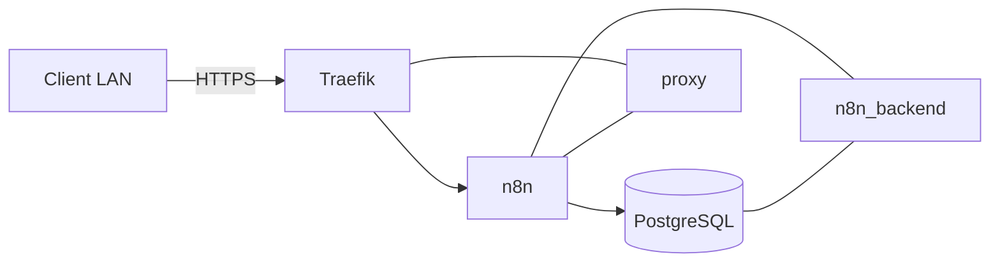

# Application — n8n

## Rôle

n8n est la plateforme d'automatisation du HomeLab. Il est déployé avec PostgreSQL et exposé en HTTPS par Traefik.

PostgreSQL n'est pas publié sur le LAN.

## Architecture



## Déploiement

```bash
ansible-playbook -K ansible/playbooks/05-applications.yml \
  --tags n8n
```

## Données et secrets

- Compose : `{{ n8n_app_dir }}/compose.yml`
- environnement : `{{ n8n_app_dir }}/.env`
- données n8n : `{{ n8n_data_dir }}/n8n`
- PostgreSQL : `{{ n8n_data_dir }}/postgres`
- clé de chiffrement : `vault_n8n_encryption_key`
- mot de passe DB : `vault_n8n_postgres_password`

`N8N_ENCRYPTION_KEY` est une donnée de reprise critique.

## Exploitation

Status :

```bash
ansible-playbook -K ansible/playbooks/07-operations.yml \
  --tags n8n \
  -e operation=status
```

Start :

```bash
ansible-playbook -K ansible/playbooks/07-operations.yml \
  --tags n8n \
  -e operation=start
```

Stop :

```bash
ansible-playbook -K ansible/playbooks/07-operations.yml \
  --tags n8n \
  -e operation=stop
```

Restart :

```bash
ansible-playbook -K ansible/playbooks/07-operations.yml \
  --tags n8n \
  -e operation=restart
```

## Backup

Le backup applicatif :

1. crée un dump PostgreSQL `pg_dump -Fc` ;
2. stocke le dump dans le staging n8n ;
3. crée un snapshot Restic tagué `n8n` et `postgres` ;
4. applique la rétention.

Exécution manuelle :

```bash
sudo systemctl start backup-n8n.service
```

Voir [Runbook — Backup n8n](../runbooks/backup-n8n.md).

## Restore

Point d'entrée recommandé :

```bash
ansible-playbook -K ansible/playbooks/08-restore.yml \
  --limit homelab01 \
  --tags n8n \
  -e snapshot_id=<SNAPSHOT_ID>
```

Le playbook délègue la logique au script `restore-n8n.sh`.

Voir [Runbook — Restore n8n](../runbooks/restore-n8n.md).

## Validation

```bash
curl -k -I https://n8n.home.arpa
```

```bash
docker exec n8n-postgres \
  pg_isready -U n8n -d n8n
```

## État

- déploiement : validé ;
- backup : validé ;
- restore réel : validé ;
- lifecycle générique : validé.
