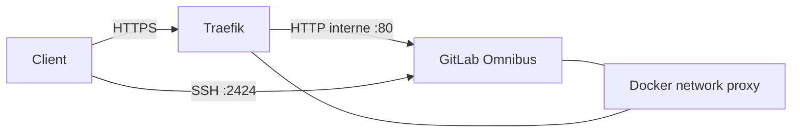
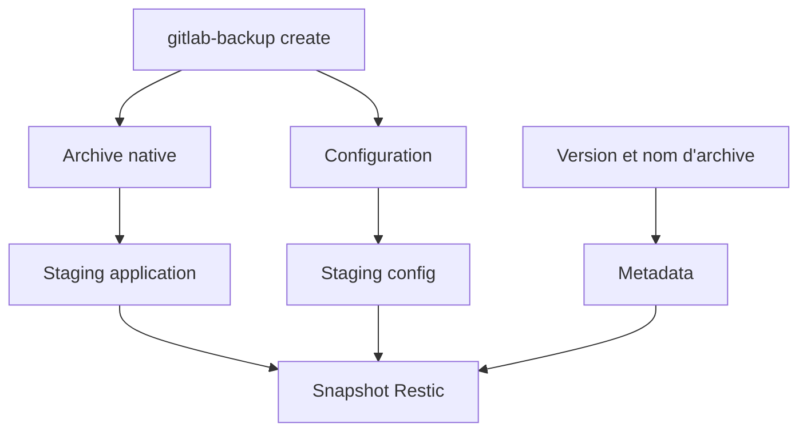

# Architecture GitLab

## Choix de déploiement

GitLab Community Edition est déployé avec l'image officielle GitLab Omnibus dans une stack Docker Compose unique.

## Flux réseau



GitLab écoute en HTTP dans le conteneur. Le chiffrement TLS est terminé par Traefik.

## Persistance

| Hôte | Conteneur |
|---|---|
| `.../gitlab/config` | `/etc/gitlab` |
| `.../gitlab/logs` | `/var/log/gitlab` |
| `.../gitlab/data` | `/var/opt/gitlab` |

## Santé

Le conteneur expose un healthcheck sur :

```text
http://localhost/-/health
```

Le rôle attend également une réponse HTTP 200 via le point d'entrée HTTPS local après le déploiement.

## Sauvegarde



La restauration vérifie la compatibilité de version avant de restaurer les données et la configuration.

## Disaster Recovery

La procédure a été exécutée et validée : retour à un état antérieur, présence des dépôts, accès Web et opérations Git.
