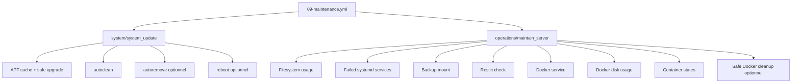

# Architecture — Maintenance serveur

## Objectif

La maintenance doit permettre d'entretenir un serveur déjà construit sans mélanger :

- configuration initiale ;
- opérations applicatives ;
- maintenance système ;
- maintenance du repository de backup.

La plateforme adopte donc deux rôles complémentaires :

```text
system/system_update
        │
        └── mise à jour du système Debian/Ubuntu

operations/maintain_server
        │
        ├── health checks
        ├── filesystem
        ├── backup mount
        ├── Restic check
        ├── Docker status
        └── Docker cleanup contrôlé
```

## Flux



## Maintenance standard

La maintenance standard est volontairement conservatrice :

- upgrade APT `safe` ;
- `autoclean` ;
- pas d'autoremove par défaut ;
- pas de reboot automatique par défaut ;
- contrôles filesystem ;
- contrôle du support de backup ;
- `restic check` ;
- état du service Docker ;
- état des conteneurs ;
- aucun prune Docker par défaut.

## Maintenance approfondie

Elle est explicitement activée via variables :

```bash
./scripts/run-playbook.sh hml mnt \
  -e system_update_autoremove=true \
  -e system_update_reboot_enabled=true \
  -e maintenance_docker_cleanup_enabled=true
```

## Nettoyage Docker

Le nettoyage automatisable est limité à :

- images dangling ;
- ancien cache du builder, par défaut âgé de plus de 30 jours.

Ne sont jamais supprimés automatiquement :

- volumes ;
- conteneurs arrêtés ;
- images utilisées ;
- ressources via `docker system prune -a`.

Cette règle est particulièrement importante sur un HomeLab on-demand : un conteneur arrêté peut être volontairement conservé.

## Restic

`restic check` vérifie l'intégrité structurelle du repository.

Il complète, mais ne remplace pas :

- les snapshots ;
- la rétention ;
- les tests réels de restauration.

Si le repository devient volumineux et que `restic check` devient trop coûteux, son exécution pourra être dissociée de la maintenance standard.
