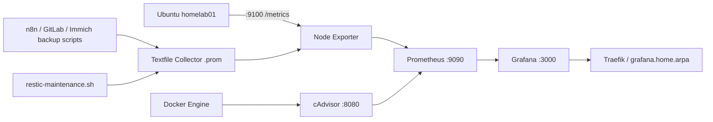

# Monitoring V1 — Architecture et fonctionnement

## Objectif

Le Monitoring V1 donne une vue exploitable de l'état du HomeLab sans introduire une stack trop complexe. Il couvre :

- l'hôte Ubuntu avec Node Exporter ;
- les conteneurs Docker avec cAdvisor ;
- la collecte et l'historisation avec Prometheus ;
- la visualisation avec Grafana ;
- la santé des backups n8n, GitLab et Immich ;
- la maintenance et l'intégrité du repository Restic ;
- l'occupation des volumes `/mnt/backupsXX` et `/mnt/mediasXX`.

Le monitoring est volontairement séparé du runtime applicatif et dispose de son propre playbook `10-monitoring.yml`.

## Chaîne complète



## Pourquoi quatre composants ?

### Node Exporter

Node Exporter expose les métriques du système Linux : CPU, mémoire, filesystem, interfaces réseau, load, uptime, etc.

Il écoute sur :

```text
:9100
```

Exemple :

```bash
curl -s http://localhost:9100/metrics | head
```

Métriques importantes :

```text
node_cpu_seconds_total
node_memory_MemAvailable_bytes
node_filesystem_avail_bytes
node_filesystem_size_bytes
node_network_receive_bytes_total
```

### cAdvisor

cAdvisor observe les conteneurs Docker et expose notamment CPU, mémoire et activité des conteneurs.

Endpoint :

```text
:8080/metrics
```

Node Exporter répond à la question « comment va le serveur ? » ; cAdvisor répond à « comment se comportent les conteneurs ? ».

### Prometheus

Prometheus collecte périodiquement les endpoints `/metrics`, conserve les séries temporelles et fournit PromQL.

Endpoint local :

```text
:9090
```

Targets V1 :

```text
prometheus     localhost:9090
node_exporter  192.168.1.144:9100
cadvisor       192.168.1.144:8080
```

La requête de santé la plus simple est :

```promql
up
```

Une target saine vaut `1`, une target inaccessible vaut `0`.

### Grafana

Grafana utilise Prometheus comme datasource et affiche les dashboards.

La datasource est provisionnée par Git avec un UID stable :

```yaml
name: Prometheus
uid: prometheus
type: prometheus
url: http://prometheus:9090
isDefault: true
```

L'UID fixe `prometheus` est important : les dashboards versionnés y font référence directement.

Grafana est exposé via Traefik sous :

```text
https://grafana.home.arpa
```

Le nom doit être résolu par le client LAN. En attendant un DNS LAN centralisé, une entrée `/etc/hosts` peut être nécessaire sur le poste client.

## Réseau Docker monitoring

Prometheus et Grafana partagent un réseau Docker externe dédié :

```text
monitoring
```

Le réseau courant utilise :

```text
172.23.0.0/16
```

Le réseau `proxy` reste séparé et sert uniquement aux workloads exposés par Traefik. Grafana appartient donc aux réseaux `monitoring` et `proxy` :

```text
Grafana
├── monitoring → communication avec Prometheus
└── proxy      → communication avec Traefik
```

Cette séparation évite de placer toutes les applications dans un unique bridge Docker. Un réseau backend représente une frontière de communication : deux conteneurs n'ont pas besoin de partager un réseau s'ils n'ont aucune raison de dialoguer directement.

### Pourquoi `/16` ?

Un `/16` réserve les 16 premiers bits au réseau et laisse 16 bits aux adresses hôtes, soit un espace très large. Ce n'est pas nécessaire pour trois conteneurs, mais c'est cohérent avec les plages Docker privées utilisées ici et évite une renumérotation lors de l'ajout de composants. Un `/24` aurait également été suffisant fonctionnellement pour une petite stack. Le choix important est surtout d'éviter les chevauchements avec le LAN et les autres bridges Docker.

## UFW et Node Exporter

Prometheus tourne dans Docker mais Node Exporter tourne comme service systemd sur l'hôte. Le trafic arrive donc depuis le subnet Docker monitoring.

La règle utilisée est de la forme :

```text
9100/tcp ALLOW FROM 172.23.0.0/16
```

Cela permet à Prometheus d'atteindre Node Exporter sans ouvrir inutilement 9100 à tous les réseaux.

## Node Exporter Textfile Collector

Les scripts de backup et Restic ne sont pas des services HTTP. Ils produisent des résultats ponctuels. Le Textfile Collector permet de convertir ces résultats en métriques Prometheus.

Répertoire :

```text
/srv/homelab/data/node_exporter/textfile/
```

Node Exporter est lancé avec :

```text
--collector.textfile.directory=/srv/homelab/data/node_exporter/textfile
```

Les scripts écrivent des fichiers `.prom` :

```text
backup_n8n.prom
backup_gitlab.prom
restic.prom
```

Node Exporter les lit et les expose dans son endpoint `/metrics`.

### Écriture atomique

Les scripts écrivent d'abord dans un fichier temporaire puis utilisent `mv` :

```bash
generate_metrics > metrics.prom.tmp
mv metrics.prom.tmp metrics.prom
```

Cela empêche Node Exporter de lire un fichier partiellement écrit pendant un scrape.

## Métriques des backups applicatifs

Les scripts n8n, GitLab et Immich utilisent un `trap EXIT`. Ainsi, même avec `set -euo pipefail`, une erreur de `pg_dump`, `docker`, `restic backup` ou `restic forget` peut être enregistrée avant la fin du script.

Métriques communes :

```text
homelab_backup_last_status{backup="n8n"}
homelab_backup_last_run_timestamp{backup="n8n"}
homelab_backup_last_success_timestamp{backup="n8n"}
homelab_backup_last_duration_seconds{backup="n8n"}
```

`last_run_timestamp` et `last_success_timestamp` sont volontairement distincts. Un job peut avoir tourné récemment tout en ayant échoué ; le dernier succès doit alors conserver son ancien timestamp.

### GitLab on-demand

GitLab peut être volontairement arrêté sur le HomeLab. Son backup ajoute donc :

```text
homelab_backup_last_skipped{backup="gitlab"}
```

Valeurs :

```text
1 = backup volontairement ignoré car GitLab est arrêté
0 = backup réellement exécuté
```

Cela évite de confondre une application volontairement éteinte avec une panne de sauvegarde.

## Métriques Restic

`restic-maintenance.service` exécute le contrôle et la maintenance du repository. Le script publie :

```text
homelab_restic_check_status
homelab_restic_check_last_run_timestamp
homelab_restic_check_last_success_timestamp
homelab_restic_check_duration_seconds
homelab_restic_snapshots_total
homelab_restic_repository_size_bytes
```

Exemple validé :

```text
homelab_restic_check_status 1
homelab_restic_check_duration_seconds 9
homelab_restic_snapshots_total 21
homelab_restic_repository_size_bytes 163440701
```

Le script exécute actuellement :

```text
restic check
restic prune
```

Puis interroge Restic en JSON pour obtenir le nombre de snapshots et la taille du repository. `jq` fait donc partie des outils du rôle backup.

## Dashboards versionnés dans Git

Les dashboards ne sont pas considérés comme une configuration manuelle de Grafana. Ils sont stockés dans le dépôt et provisionnés au démarrage.

Répertoire :

```text
ansible/roles/monitoring/grafana/files/dashboards/
```

Dashboards V1 :

```text
node-exporter-full.json
cadvisor-docker.json
storage-backup-health.json
```

Le provisioning Grafana monte :

```text
/srv/homelab/data/grafana/provisioning -> /etc/grafana/provisioning
/srv/homelab/data/grafana/dashboards  -> /var/lib/grafana/dashboards
```

Attention : il faut monter le dossier parent `provisioning`, et non uniquement `provisioning/datasources`, sinon Grafana ne trouve pas `datasources/` et `dashboards/` sous `/etc/grafana/provisioning`.

## Dashboard Storage & Backup Health

Ce dashboard regroupe :

- statut du dernier backup n8n/GitLab/Immich ;
- âge du dernier backup réussi ;
- durée du dernier backup ;
- résultat du dernier contrôle Restic ;
- âge du dernier contrôle Restic réussi ;
- durée du contrôle ;
- nombre de snapshots ;
- taille du repository ;
- occupation des volumes backup et médias.

Les volumes sont découverts dynamiquement avec :

```promql
node_filesystem_size_bytes{mountpoint=~"/mnt/(backups|medias)[0-9]+"}
```

Le pourcentage utilisé est calculé avec :

```promql
100 * (
  1 - (
    node_filesystem_avail_bytes{mountpoint=~"/mnt/(backups|medias)[0-9]+"}
    /
    node_filesystem_size_bytes{mountpoint=~"/mnt/(backups|medias)[0-9]+"}
  )
)
```

Cette regex prépare automatiquement :

```text
/mnt/backups01
/mnt/backups02
/mnt/medias01
/mnt/medias02
```

sans modifier le dashboard lors de l'ajout d'un nouveau volume respectant la convention.

## Seuils V1

Valeurs initiales du dashboard :

```text
backup status     1 OK / 0 FAILED
backup age        <24h OK / 24-48h warning / >48h critique
storage usage     <70% OK / 70-85% warning / >85% critique
restic check      1 OK / 0 FAILED
```

Les seuils de backup doivent être ajustés si la fréquence réelle des timers change.

## Validation de bout en bout

### Node Exporter

```bash
curl -s http://localhost:9100/metrics \
  | grep '^node_cpu_seconds_total' | head
```

### cAdvisor

```bash
curl -s http://localhost:8080/metrics | head
```

### Prometheus targets

```bash
curl -sG \
  --data-urlencode 'query=up' \
  http://localhost:9090/api/v1/query \
  | python3 -m json.tool
```

Toutes les targets attendues doivent valoir `1`.

### Backup metrics

```bash
curl -s http://localhost:9100/metrics \
  | grep '^homelab_backup'
```

### Restic metrics

```bash
curl -s http://localhost:9100/metrics \
  | grep '^homelab_restic'
```

## Dépannage — leçons apprises

### `up=0` pour Node Exporter depuis Prometheus

Si `curl http://192.168.1.144:9100/metrics` fonctionne sur l'hôte mais bloque depuis le réseau Docker, vérifier UFW et autoriser le subnet du réseau `monitoring` vers 9100.

### Grafana démarre mais les dossiers provisioning sont absents

Vérifier :

```bash
docker inspect grafana \
  --format '{{range .Mounts}}{{println .Source "->" .Destination}}{{end}}'
```

Le montage attendu est le parent :

```text
.../grafana/provisioning -> /etc/grafana/provisioning
```

### `Datasource provisioning error: data source not found`

Une datasource Prometheus créée auparavant par l'UI peut posséder un UID généré, alors que les dashboards Git utilisent `uid: prometheus`.

Le provisioning doit supprimer l'ancienne datasource par nom puis recréer celle avec UID stable :

```yaml
deleteDatasources:
  - name: Prometheus
    orgId: 1

datasources:
  - name: Prometheus
    uid: prometheus
    type: prometheus
```

### Grafana fonctionne sur `localhost:3000` mais pas sur `grafana.home.arpa`

Tester d'abord :

```bash
curl -I http://localhost:3000
curl -I http://192.168.1.144:3000
```

Si ces deux tests répondent mais que le hostname ne fonctionne pas, vérifier la résolution DNS du **poste client**. Le serveur HomeLab n'a pas besoin de résoudre lui-même `grafana.home.arpa` pour que le navigateur du PC y accède.

## Ce qui reste après V1

- Alerting V1 : backup failed, backup stale, Restic check failed, stockage >85 %, target down ;
- réduction des ports publiés directement sur l'hôte ;
- métriques Traefik ;
- métriques PostgreSQL ;
- monitoring applicatif GitLab/n8n/Immich ;
- supervision des services et timers systemd ;
- Loki pour les logs ;
- Alertmanager si le besoin dépasse Grafana Alerting ;
- monitoring matériel : températures et SMART ;
- centralisation HomeLab + VPS.

## Extension — Backups VPS et collecte distante

Le monitoring distingue désormais deux événements différents :

1. l'exécution du backup applicatif ;
2. la publication des métriques de backup.

### Métriques applicatives

```text
backup_last_status{backup="n8n|nextcloud|wordpress|..."}
backup_last_run_timestamp{backup="..."}
backup_last_success_timestamp{backup="..."}
backup_last_duration_seconds{backup="..."}
```

### Dashboard Backup Health

Le dashboard `backup-health.json` contient deux lignes logiques :

```text
Backup Status              | Age of Last Successful Backup | Backup Duration
Remote Collection Status   | Age of Last Remote Collection | Remote Collection Duration
```

PromQL :

```promql
backup_last_status
```

```promql
time() - backup_last_success_timestamp
```

```promql
backup_last_duration_seconds
```

```promql
backup_remote_collect_status
```

```promql
time() - backup_remote_collect_timestamp
```

```promql
backup_remote_collect_duration_seconds
```

La légende de collecte utilise `{{source}} / {{backup}}`, par exemple `vps01 / wordpress`.

Cette séparation rend visible le cas important : backup VPS réussi mais copie hors VPS échouée.
