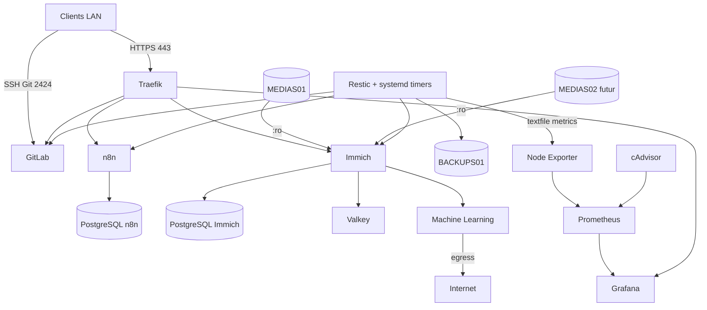

# Vue d'ensemble de l'architecture

## Architecture logique



## Couches

| Couche | Responsabilité | Exemples |
|---|---|---|
| `system` | OS, réseau, paquets | Netplan, mises à jour |
| `platform` | capacités partagées | Docker, réseaux, Traefik, Restic, media_storage |
| `monitoring` | observabilité | Node Exporter, cAdvisor, Prometheus, Grafana |
| `applications` | workloads | n8n, GitLab, Immich, Nextcloud, WordPress |
| `operations` | exploitation | lifecycle, backup, restore, maintenance |

## Principes

1. L'inventory décrit l'environnement réel.
2. Les rôles restent réutilisables et centrés sur une responsabilité.
3. Traefik centralise HTTPS.
4. Les bases restent sur des réseaux backend privés.
5. Les accès Internet sont donnés uniquement lorsque nécessaires.
6. Ansible configure ; systemd planifie.
7. Les médias originaux restent indépendants d'Immich.
8. Les sauvegardes évitent les données reconstructibles.
9. Un backup doit être vérifiable/restaurable.

## Exploitation

```text
06-backup       → capacité de sauvegarde
07-operations   → lifecycle des applications
08-restore      → restore orchestré n8n/GitLab
09-maintenance  → entretien et health checks
10-monitoring   → observabilité hôte / conteneurs / backups / stockage
```

Immich dispose en plus d'un script de restore avec mode `--verify-only`.

## Media Center

```text
PC principal
   │
   ├── rsync ─────────► MEDIAS01/MEDIAS02
   └── backup médias ─► disque séparé

MEDIAS01/MEDIAS02
   │ LUKS + ext4
   ▼
media_storage
   │
   └──► Immich :ro
           │
           ├── PostgreSQL
           ├── Valkey
           └── Machine Learning
```


## Extension VPS Production

Le même dépôt pilote désormais deux environnements distincts :

```text
all
├── homelab
│   └── homelab01
└── vps
    └── vps01
```

Le HomeLab reste le laboratoire et le point de centralisation des sauvegardes. Le VPS héberge les services publics persistants.

```text
Internet → Traefik VPS → n8n / Nextcloud / WordPress
                         ↓
                  backups applicatifs
                         ↓
                /srv/vps/backups
                         ↓ SSH read-only
              HomeLab /backups/vps01
                         ↓
                       Restic
```

Voir [VPS Production](vps.md).
